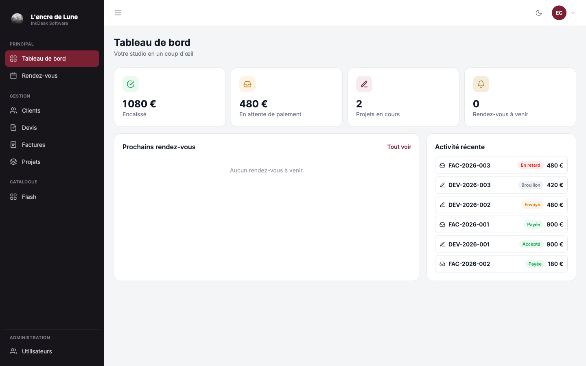
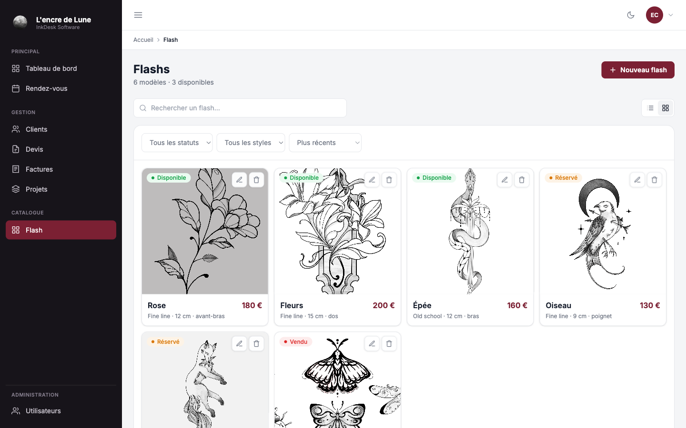

<h1 align="center">InkDesk Software</h1>

<p align="center">
  Le logiciel de gestion des studios de tatouage.
</p>


## À propos

**InkDesk** est un CRM pour studios de tatouage : fiches clients, projets de tatouage et
leurs séances, agenda, devis et factures réunis dans une seule application web. Chaque
artiste dispose de son propre compte et ne voit que ses données.

<p align="center">
  
  <br><sub>Tableau de bord : encaissements, paiements en attente et activité récente</sub>
</p>

<p align="center">
  
  <br><sub>Catalogue de flashs avec statuts disponible, réservé et vendu</sub>
</p>

## Fonctionnalités

- **Clients** : fiches détaillées, recherche et filtres
- **Projets** : suivi d'un tatouage et de ses séances
- **Rendez-vous** : agenda des séances à venir et passées
- **Devis et factures** : lignes, totaux, conversion d'un devis en facture
- **Flashs** : catalogue de modèles avec envoi d'images
- **Équipe** : gestion des membres du studio et de leurs rôles

## Technologies

**Angular 22** · TypeScript · Tailwind CSS<br>
**PHP 8** sans framework · MySQL

---

## Installation

### Prérequis

- **PHP 8.5** et **MySQL 8.0**, via [MAMP](https://www.mamp.info)
- **Node.js 20** ou supérieur

### 1 · Récupérer le projet

```bash
git clone https://github.com/charlieWanlin/inkdesk_software.git
cd inkdesk_software
```

### 2 · Créer la base de données

Ouvrez MAMP et cliquez sur **Start Servers**. MySQL écoute alors sur le port `8889`.

**Option A, par phpMyAdmin**

1. Rendez-vous sur `http://localhost:8888/phpMyAdmin`
2. Onglet **Bases de données**, créez `crm_tatooshop` avec l'interclassement `utf8mb4_general_ci`. Si elle existe déjà, passez directement à l'étape suivante
3. Sélectionnez cette base, onglet **Importer**, envoyez `backend/database/schema.sql`
4. Recommencez l'import avec `backend/database/seed.sql`

**Option B, en ligne de commande**

```bash
/Applications/MAMP/Library/bin/mysql80/bin/mysql -u root -proot -h 127.0.0.1 -P 8889 -e "CREATE DATABASE IF NOT EXISTS crm_tatooshop CHARACTER SET utf8mb4;"
/Applications/MAMP/Library/bin/mysql80/bin/mysql -u root -proot -h 127.0.0.1 -P 8889 crm_tatooshop < backend/database/schema.sql
/Applications/MAMP/Library/bin/mysql80/bin/mysql -u root -proot -h 127.0.0.1 -P 8889 crm_tatooshop < backend/database/seed.sql
```

L'ordre compte : `schema.sql` crée les tables, `seed.sql` les remplit.

### 3 · Configurer l'API

Créez le fichier `backend/.env` :

```ini
DB_HOST=127.0.0.1
DB_PORT=8889
DB_NAME=crm_tatooshop
DB_USER=root
DB_PASS=root

JWT_SECRET=remplacez_par_la_cle_generee
JWT_DUREE=86400
```

Générez la clé avec la commande suivante, puis recopiez le résultat dans `JWT_SECRET` :

```bash
openssl rand -hex 32
```

Cette clé sert à signer les jetons de connexion. Le serveur vérifie la signature à chaque requête, ce qui lui permet de savoir qu'un jeton vient bien de lui et n'a pas été modifié. Elle doit donc rester propre à votre installation.

`DB_PORT=8889` correspond à MAMP. Avec une installation MySQL classique, utilisez `3306`.

### 4 · Lancer l'API

```bash
php -S localhost:8000 -t backend/public
```

### 5 · Lancer l'application

Dans un second terminal :

```bash
cd frontend
npm install
npm start
```

L'application est disponible sur **http://localhost:4200**.

### 6 · Se connecter

| Rôle | Email | Mot de passe |
|------|-------|--------------|
| Administrateur | `admin@tatooshop.test` | `admin123` |
| Artiste | `camille@tatooshop.test` | `admin123` |

---

<p align="center">
  <sub>
    Développé par <strong>Charlie Wanlin</strong>, projet réalisé dans le cadre du titre
    professionnel Développeur Web &amp; Web Mobile.
  </sub>
</p>
